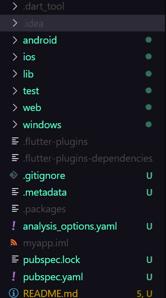

<!-- quick look around.   package manager test folder yaml files , pubspec using pubspec-->
<!-- title:6 /100 DaysOfFlutter : Introduction to flutter Codebase-->
<!--  specs: Knowing about flutter creating project, folderstruture, package manager, yaml-->

# Create Flutter Project.
Flutter project can be createde using mutiple ways.
here we will creating using terminal

```bash
flutter create <project_name>
```
it will create a new project in the current directory.

# Project Stucture

## [`andriod folder`](https://github.com/theabhayprajapati/100DaysOfFlutter/tree/main/day6/flutter/myapp/android)
As flutter is the cross platform mobile app development framework, for making apps for andriod configuration is required, and that is done in [`andriod`](https://github.com/theabhayprajapati/100DaysOfFlutter/tree/main/day6/flutter/myapp/android) folder, you can also find gradle file in this folder.which is package manager for andriod.

## [`ios folder`]([./ios/](https://github.com/theabhayprajapati/100DaysOfFlutter/tree/main/day6/flutter/myapp/ios))
for making apps for ios configuration is required, and that is done in [`ios`](https://github.com/theabhayprajapati/100DaysOfFlutter/tree/main/day6/flutter/myapp/ios) folder, even here you can find xcode project file, for packages and plugins.

## [`lib`](https://github.com/theabhayprajapati/100DaysOfFlutter/tree/main/day6/flutter/myapp/lib/main.dart)
this is the main folder for all the code, which is used for creating the app, everything start's from here in flutter.

>same stuff for [`windows`](https://github.com/theabhayprajapati/100DaysOfFlutter/tree/main/day6/flutter/myapp/windows/runner/main.cpp) and [`web`](https://github.com/theabhayprajapati/100DaysOfFlutter/tree/main/day6/flutter/myapp/web/)

## [`pubspec.yaml`](https://github.com/theabhayprajapati/100DaysOfFlutter/tree/main/day6/flutter/myapp/pubspec.yaml)
Here is every information regarding your application from **name:**, **description**, **version**, what other packages your are using.

# Packages What you they ?
Packages are the libraries which can be used in your application.
In simple words, here **people**, **organisation**, even other  **open source communtities** have build and you can use then

it is similar to **NPM** for nodejs, **pip** for python, and so on


## Package Manager for Flutter(dart)🎯
[`pub.dev`](https://pub.dev) is the package manager for flutter, it is used for installing packages, and for managing packages

see and sample flutter project here
**repolink**: [`@github`](https://github.com/theabhayprajapati/100DaysOfFlutter/tree/main/day6/flutter/myapp)

ping 🤙🏾 me on [`@twitter`](https://twitter.com/abhayprajapati_)                            
